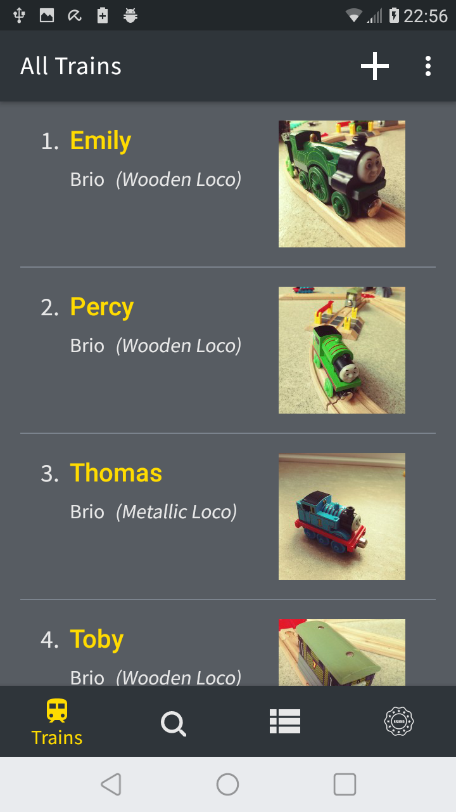
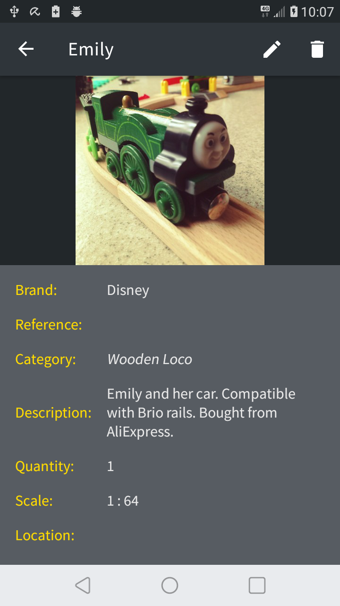
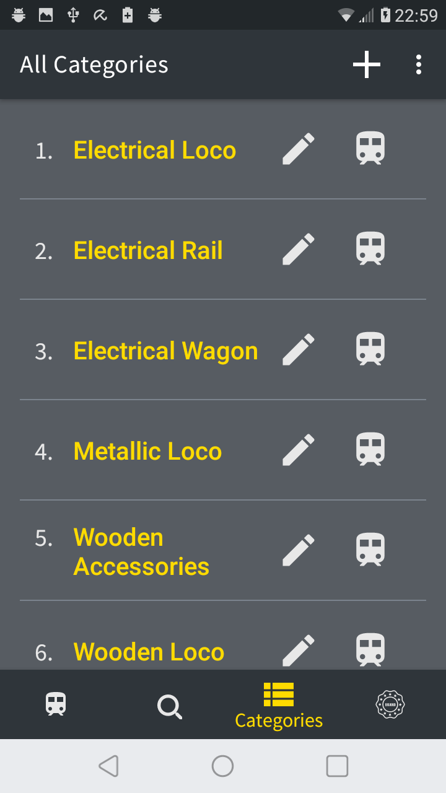

# TrainInventory
This is an inventory app that I made for the train collection of my husband and sons. It also became my practice project. I keep refactoring it and adding features. It uses MVVM architecture with Room, Dagger2, Paging3, Navigation, WorkManager, Coroutines, Flows and Data Binding. 
Application has the feature to export sql database to excel file.
There is a trash folder for deleted trains. Items in trash are deleted after 30 days, with the help of WorkManager.
Icons on the action menu are animated vector drawables(AVD) that I designed in ShapeShifter.

The repo contains lots of integration tests and also unit tests and it uses Github Actions for Continuous Integration.

## Screenshots

  
  

  
  

  
  

  
  

  
  

